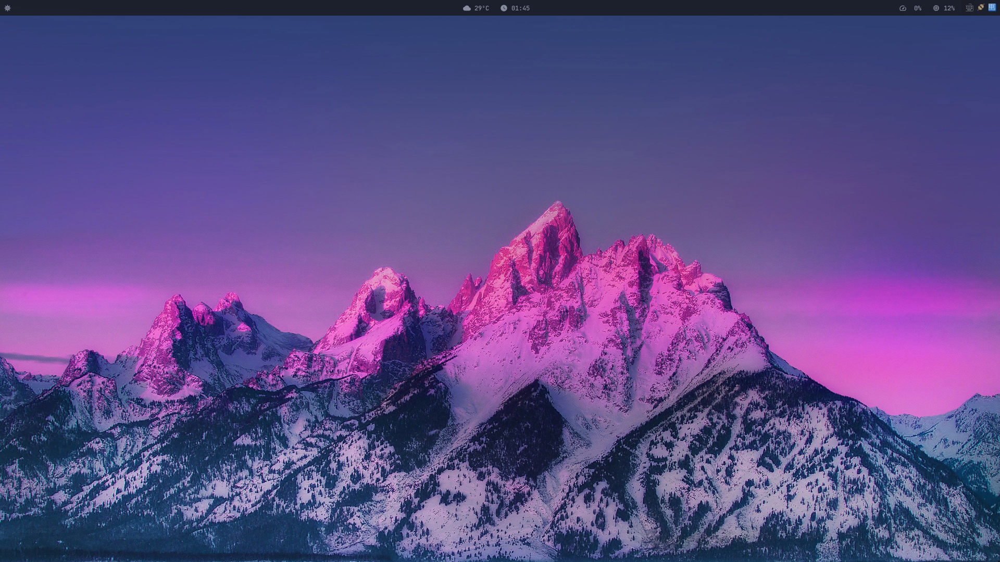
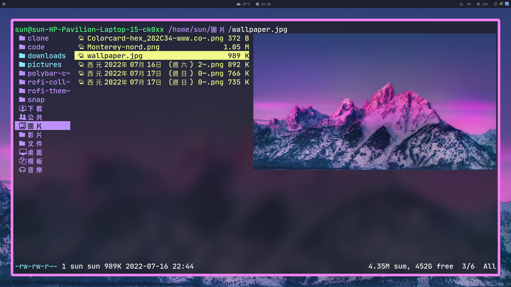
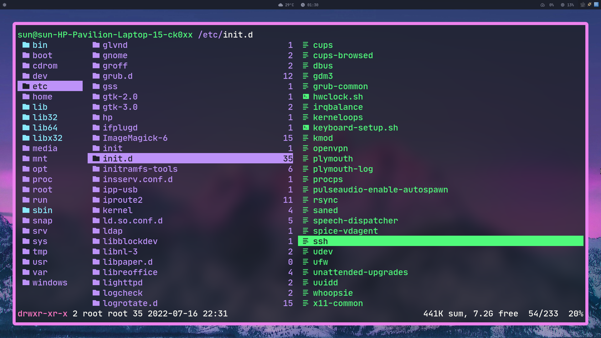
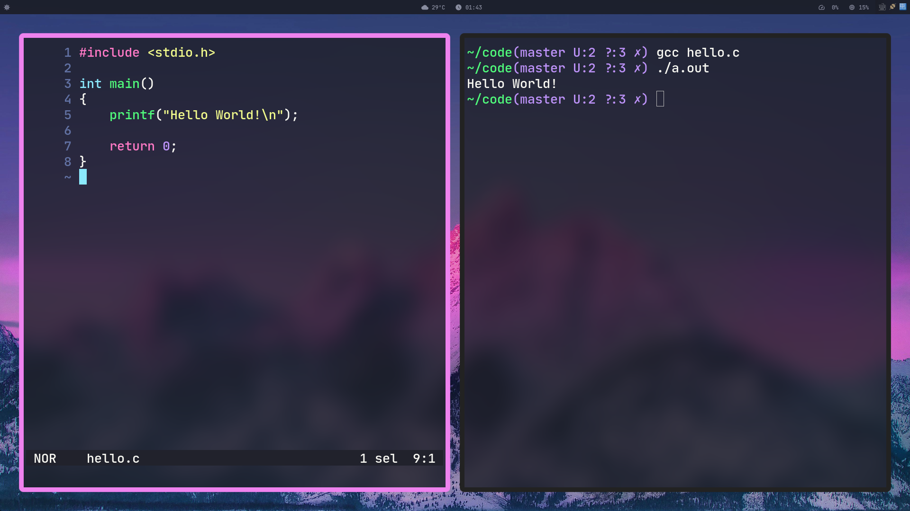
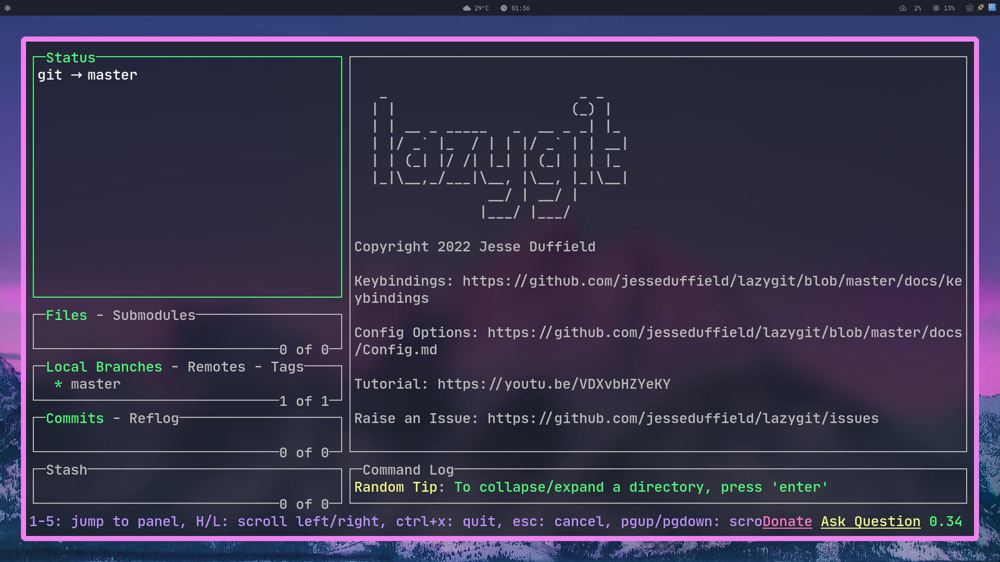

# Dracula_Mountain

## Cover

### Desktop


### Ranger 1


### Ranger 2


### Code


### Lazygit


## Tools

* [i3-gaps](https://github.com/Airblader/i3)
* [picom](https://github.com/jonaburg/picom)
* [rofi](https://github.com/davatorium/rofi)
* [polybar](https://github.com/polybar/polybar)

## Installation

Ubuntu 22.04 fresh install.

### i3-gaps

安裝 git

```bash
sudo apt install git
```

安裝 Dependencies: 

```bash
sudo apt install meson dh-autoreconf libxcb-keysyms1-dev libpango1.0-dev libxcb-util0-dev xcb libxcb1-dev libxcb-icccm4-dev libyajl-dev libev-dev libxcb-xkb-dev libxcb-cursor-dev libxkbcommon-dev libxcb-xinerama0-dev libxkbcommon-x11-dev libstartup-notification0-dev libxcb-randr0-dev libxcb-xrm0 libxcb-xrm-dev libxcb-shape0 libxcb-shape0-dev automake libtool xutils-dev autoconf
```

安裝 i3-gaps: 

```bash
mkdir clone
cd clone
git clone https://github.com/Airblader/i3 i3-gaps
cd i3-gaps
mkdir -p build && cd build
meson --prefix /usr/local
ninja
sudo ninja install
```

登出就可以選擇 i3 login 了

## Fonts

`JetBrainsMono Nerd Font`

[Nerd Font](https://www.nerdfonts.com/font-downloads)

### Install font-manager

好用的字體管理工具 (你會需要的)

```bash
sudo apt install font-manager
```

### Command

使用指令安裝多種字體

> 所在位置 ~/
```bash
mkdir .fonts
cd .fonts
# 把所有要安裝的 ttf 丟到這裡
fc-cache -fv
# 可以使用 font-manager 來確認字體是否安裝成功
```

## Wallpaper


## Reference

* [How to build and install i3-gaps from source on debian](https://lottalinuxlinks.com/how-to-build-and-install-i3-gaps-on-debian/)